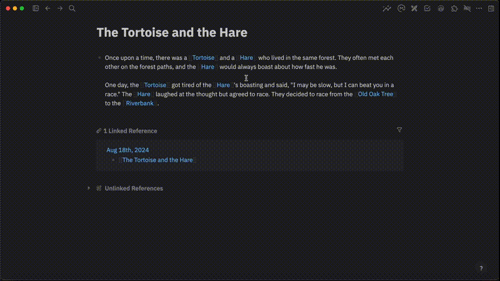

# BrainSeq - AI Assistant

  

  This plugin will <b>analyze</b> the <b>currently open document</b> and all <b>related documents</b>, utilizing them as <b>context</b> for your <b>conversation</b> with your favourite GPT model.

## Demo

  

## Providers
- Gemini
- OpenAI

## What is Logseq?
Logseq is a privacy-first, open-source knowledge base. Visit https://logseq.com for more information.

## Support Me

  

## License
<a href="https://github.com/galihlprakoso/logseq-plugin-assistseq-ai-assistant/blob/master/LICENSE">MIT License</a>
